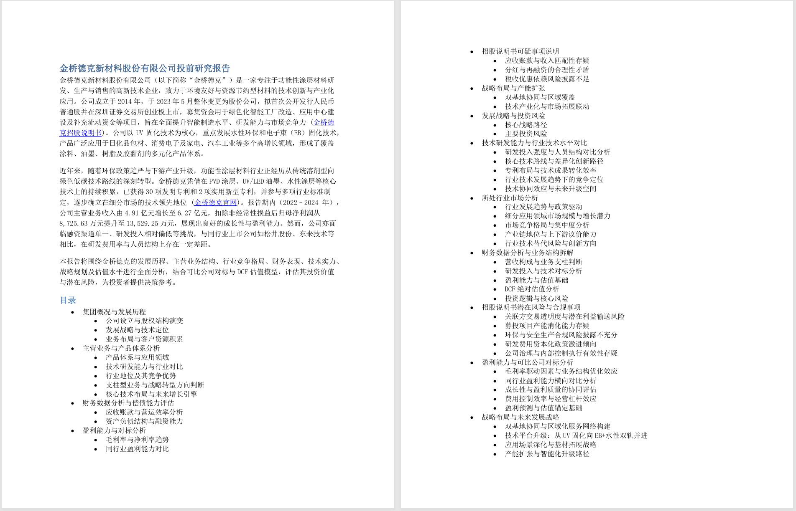
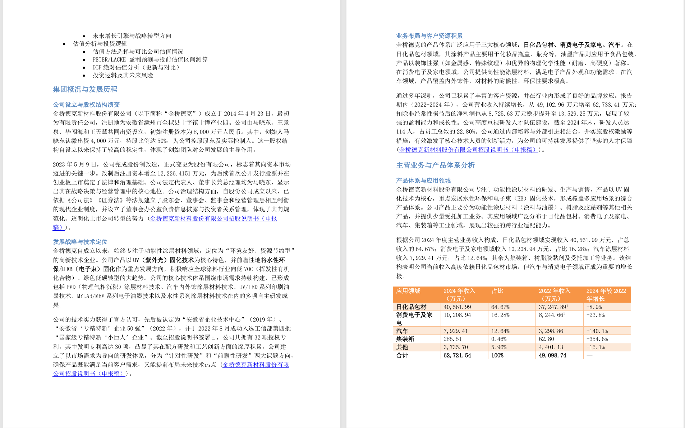
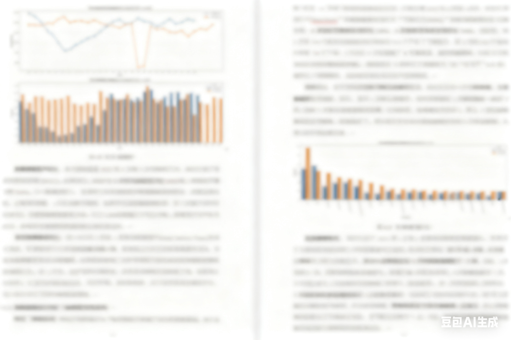

# InsightReportGen

> 🚀 基于多智能体的协同合作，实现从 **需求分析 → 联网搜索 → 文档分析 → 代码与图表生成 → 结构化报告输出** 的全流程自动化。

------

## 📌 项目简介

本项目旨在构建一个 **多智能体协作系统**，通过模块化智能体的分工与协作，完成从需求输入到最终报告生成的自动化流程。
 系统结合 **大语言模型 (LLM)**、**RAG 知识检索**、**智能体调度框架**，实现高效、准确的科研与数据分析辅助。

------

## 🔑 核心功能

- **需求分析**：根据用户输入进行任务拆解与智能体角色分配
- **联网搜索**：自动调用文献检索与实时搜索接口，获取最新信息
- **文档分析**：结合本地资料与检索结果进行清洗、结构化与向量化
- **代码生成**：输出可复现的 Python/R 代码与数据可视化图表
- **报告撰写**：基于全流程上下文生成结构化科研报告
- **交互优化**：支持用户二次修改与解释，确保最终结果符合需求

------

## 🧩 系统架构

```
┌───────────────────────┐
│      Analyzer Agent    │ → 需求分析与任务拆解
└──────────────┬────────┘
               ↓
┌───────────────────────┐
│       Coder Agent      │ → 模型开发 / 代码与图表生成
└──────────────┬────────┘
               ↓
┌───────────────────────┐
│    Researcher Agent    │ → 联网搜索 / 文档分析 / 数据清洗
└──────────────┬────────┘
               ↓
┌───────────────────────┐
│      Writer Agent      │ → 报告撰写与结构化输出
└──────────────┬────────┘
               ↓
┌───────────────────────┐
│       Chat Agent       │ → 用户交互 / 报告优化
└───────────────────────┘
```

------

## 🛠️ 工具定义

- **代码管理工具**
   支持代码插入、输出捕获、错误记录与执行回写
- **智能检索工具**
   集成 **MCP** 与 **Tavily API**，支持文献检索与实时联网搜索
- **知识管理工具**
   基于 **RAG 技术** 构建本地化知识库，支持用户资料的高效检索与问答

------

## 📦 样例

- **行研报告：**





- **数据报告：（内容已使用豆包模糊处理）**

